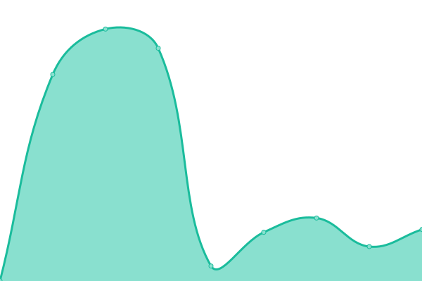

# [📈 Live Status](<[https://demo.upptime.js.org](https://ryaale.github.io/geoscore-uptime/)>): <!--live status--> **🟩 All systems operational**

This repository contains the open-source uptime monitor and status page for [GeoScore](https://geoscore.com.au), powered by [Upptime](https://github.com/upptime/upptime).

<!--start: status pages-->
<!-- This summary is generated by Upptime (https://github.com/upptime/upptime) -->
<!-- Do not edit this manually, your changes will be overwritten -->
<!-- prettier-ignore -->
| URL | Status | History | Response Time | Uptime |
| --- | ------ | ------- | ------------- | ------ |
|  [GeoScore](https://geoscore.com.au) | 🟩 Up | [geo-score.yml](https://github.com/ryaale/geoscore-uptime/commits/HEAD/history/geo-score.yml) | 

 776ms
     
 | 

<a href="https://ryaale.github.io/geoscore-uptime/history/geo-score">100.00%</a>
    

<!--end: status pages-->

[**Status website →**](<[https://demo.upptime.js.org](https://ryaale.github.io/geoscore-uptime/)>)

## 📄 License

- Powered by: [Upptime](https://github.com/upptime/upptime)
- Code: [MIT](./LICENSE) © [Anand Chowdhary](https://anandchowdhary.com), supported by [Pabio](https://pabio.com)
- Data in the `./history` directory: [Open Database License](https://opendatacommons.org/licenses/odbl/1-0/)
